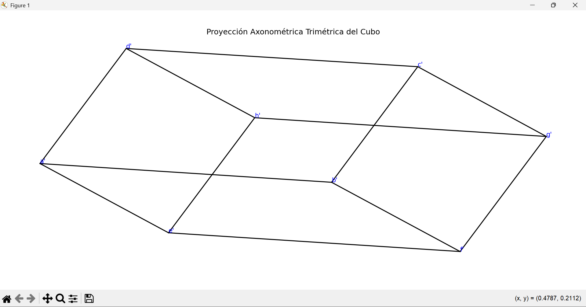

# Proyección Axonométrica Trimétrica del Cubo Unitario

Este programa visualiza una **proyección axonométrica trimétrica** de un cubo unitario en 3D utilizando puntos proyectados previamente calculados. Se utiliza la biblioteca `matplotlib` para graficar la figura resultante en 2D.

---

## Descripción

La proyección axonométrica trimétrica representa un cubo en perspectiva, donde los tres ejes tienen **ángulos y escalas diferentes** (`a ≠ b ≠ c`). Esta proyección da una vista más realista del cubo que la isométrica o dimétrica.

En este script:

- Se definen 8 puntos proyectados (`a'` a `h'`) que representan los vértices de un cubo.
- Se conectan los vértices según las aristas típicas de un cubo.
- Se dibuja el cubo en un gráfico 2D, con sus vértices etiquetados.

---

## Librerías utilizadas

- `numpy`: Para el manejo de arreglos numéricos.
- `matplotlib.pyplot`: Para graficar el cubo proyectado.

---

##  Cómo ejecutar

1. Asegúrate de tener Python 3 instalado.
   1.1 Ejecutar: python Grafo.py 
2. Instala las dependencias necesarias (si aún no lo has hecho):

```bash
pip install numpy
pip install matplotlib

```
## 📊 Resultado Gráfico



